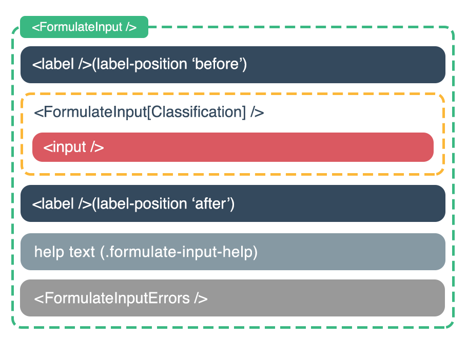

# Custom input types

If the input type you're looking for is not part of the built-in fields (mostly
HTML5 input types), and you haven't found a [plugin](/guide/plugins) that adds
the functionality you need — you can create input types of your own.

### Preamble: Composition over scoped slots

A core concept in Vue Formulate is the ability for developers to _compose_ their
forms using a dead-simple API with a single component. True to that goal, when
developing a custom input you want to maintain that same ease of composition
by create your own `type` of `FormulateInput`, ensuring the way you build forms
and fields stays consistent even when using custom inputs.

This is notably different than many Vue libraries that make heavy use of scoped
slots as the primary mechanism of extension. Vue Formulate has robust support
for [scoped slots](/guide/inputs/slots/), but these should be used more
for the occasional override rather than the customization of the entire utility.
A tell-tale sign that you could implement this principle better is if you find
yourself doing a lot of copy-paste of scoped slots, or wrapping `FormulateInput`
in wrapper components.

## Structure of an input

Before diving into code, let’s take a high-level look at how a
`FormulateInput` component is structured:



## Custom types

Let’s tackle an autocomplete field. Our goal is to extend Vue Formulate to allow
for new inputs that look like this:

```vue
<FormulateInput
  type="autocomplete"
  name="user"
  label="Search for a user"
  :options="[
    { value: 1, label: 'Jon Doe'},
    { value: 2, label: 'Jane Roe'},
    { value: 3, label: 'Bob Foe'},
    { value: 4, label: 'Ben Cho'},
  ]"
/>
```

To do this, we need to write a custom component that handles the "autocomplete"
input logic. Each `type` is designated as a component and a classification. Both
components and classifications can be shared across multiple `types`.

#### What is a classification?

A classification is just a helpful way to group logic and styling rules around
similar input types, but just because you create a new input `type` doesn’t
necessarily mean you would create a new grouping classification. In fact,
our example autocomplete would fit well under the `text` classification.

#### What is an input component?

The input component, on the other hand, is a Vue component, that is passed a
[`context` prop](#context) and is responsible for the input’s logic
and presentation. This component can be used for entirely new input systems,
business logic, or custom UI.

If you want field validation, form aggregation, hydration and the other
benefits of Vue Formulate there is only one requirement: the value of the field
should be read from `context.model` and written to `context.model`. This is a
special getter/setter property bound to the root `<FormulateInput />`.

:::details View example autocomplete source
_File: MyFormulateAutocomplete.vue_
```vue
<template>
  <div
    :class="`formulate-input-element formulate-input-element--${context.type}`"
    :data-type="context.type"
  >
    <input
      type="text"
      v-model="context.model"
      v-bind="context.attributes"
      autocomplete="no"
      @keydown.enter.prevent="context.model = selection.label"
      @keydown.down.prevent="increment"
      @keydown.up.prevent="decrement"
      @blur="context.blurHandler"
    >
    <ul
      v-if="filteredOptions.length"
      class="formulate-input-dropdown"
    >
      <li
        v-for="(option, index) in filteredOptions"
        :key="option.value"
        v-text="option.label"
        :data-is-selected="selection && selection.value === option.value"
        @mouseenter="selectedIndex = index"
        @click="context.model = selection.label"
      />
    </ul>
  </div>
</template>

<script>
export default {
  props: {
    context: {
      type: Object,
      required: true
    },
  },
  data () {
    return {
      selectedIndex: 0
    }
  },
  watch: {
    model () {
      this.selectedIndex = 0
    }
  },
  computed: {
    model () {
      return this.context.model
    },
    selection () {
      if (this.filteredOptions[this.selectedIndex]) {
        return this.filteredOptions[this.selectedIndex]
      }
      return false
    },
    filteredOptions () {
      if (Array.isArray(this.context.options) && this.context.model) {
        const isAlreadySelected = this.context.options.find(option => option.label === this.context.model)
        if (!isAlreadySelected) {
          return this.context.options
            .filter(option => option.label.toLowerCase().includes(this.context.model.toLowerCase()))
        }
      }
      return []
    }
  },
  methods: {
    increment () {
      const length = this.filteredOptions.length
      if (this.selectedIndex + 1 < length) {
        this.selectedIndex++
      } else {
        this.selectedIndex = 0
      }
    },
    decrement () {
      const length = this.filteredOptions.length
      if (this.selectedIndex - 1 >= 0) {
        this.selectedIndex--
      } else {
        this.selectedIndex = length - 1
      }
    }
  }
}
</script>
```
_Note: in the above example we wrap our `<template>` with a div containing some
`.formulate-input-element` classes, this is not required, but is a good practice
to keep things consistent for theme authors._
:::

## Registering an input

Once your input component is written, you need to let Vue Formulate know there
is a new `type` of input and it has a custom component (and/or `classification`).
You do this by extending the `library` global option.

```js
import Vue from 'vue'
import VueFormulate from '@braid/vue-formulate'
import MyFormulateAutocomplete from './MyFormulateAutocomplete'

// register your component with Vue
Vue.component('MyFormulateAutocomplete', MyFormulateAutocomplete)

Vue.use(VueFormulate, {
  library: {
    autocomplete: {
      classification: 'text',
      component: 'MyFormulateAutocomplete'
    }
  }
})
```

Presto! You’ve now extended Vue Formulate to include a custom input type.

<demo-custom-input />
